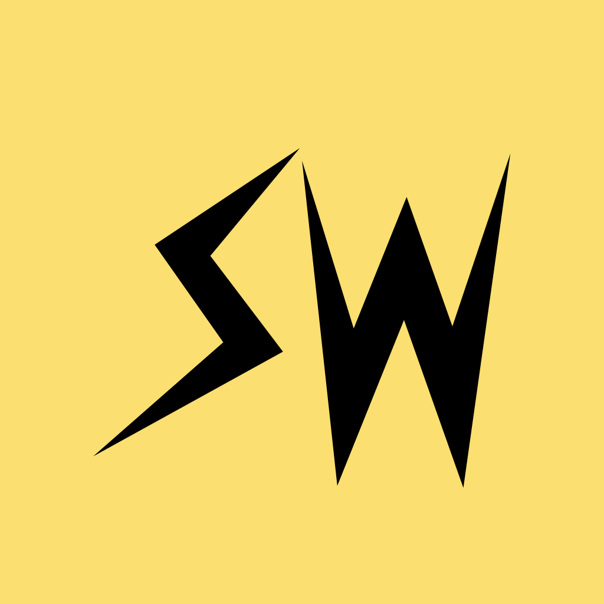

<p align="center">

</p>

# Stacker Watch

An unofficial Apple Watch app for reading [stacker.news](https://stacker.news).

This repo holds only the watch app. It is not the stacker.news site; that lives at
[stackernews/stacker.news](https://github.com/stackernews/stacker.news). The app is
not affiliated with or endorsed by stacker.news.

Stage 1 is read-only: no login, no zaps, no posting. Open the app, a post fills the screen,
turn the Digital Crown to move to the next one, tap to read the whole thing. Made for reading
a few paragraphs in bed.

## What it does

- **Screens**: up to 6 horizontal pages; swipe left/right between them. Each is either a
  site-wide feed (Hot, Recent, Top this week) or one territory with one sort, so
  `~bitcoin · Hot` and `~bitcoin · Recent` can both be their own page. A fresh install
  starts with the three site-wide feeds.
- **Tiles**: one post per page in a vertical pager. The crown or a swipe moves between posts.
  Each tile shows the territory and the poster; zaps are in the reader.
- **Reader**: tap a tile for the full post, rendered from markdown, followed by the top-level
  comments. The crown scrolls.
- **No waiting**: every screen refreshes in the background on launch and on foreground, so a
  sideways swipe lands on posts instead of a spinner.
- **Settings**: the leftmost page, one swipe right from the first feed. Long-press and drag to
  reorder screens, set the text size, toggle link posts, and open *Modify screens* to add or
  remove with check marks. Territories you have chosen sort to the top there, and the
  territory list is cached for a month rather than refetched on every visit. No toolbar
  buttons — on watchOS those render as tinted circles on top of the text.
- **Instant launch**: every screen is cached on disk, so a post appears before the network
  answers. Cached posts are readable offline.
- **Dark**: black background, stacker.news yellow accent. watchOS has no light mode.

## Layout

```
SNKit/          Swift package, Foundation only: GraphQL client, models, paging, markdown, cache.
                Unit tests run on macOS and Linux with `swift test`.
StackerWatch/   watchOS SwiftUI app plus its iOS container (Xcode project + sources + assets).
Tools/          Icon generator.
```

The app talks to the public GraphQL endpoint at `https://stacker.news/api/graphql` with three
queries: `items(...)` for feeds (passing `sub` for a territory), `item(id:)` for a post with
its comments, and `topSubs(...)` to list territories in settings. No API key.

## Build on a Mac

Requirements: Xcode 15 or newer. No other tooling.

```sh
git clone https://github.com/obvioussummer46/stacker.watch.git
open stacker.watch/StackerWatch/StackerWatch.xcodeproj
```

Simulator builds work straight from a clone. For a device build or an archive you need your own
Apple Team ID, which the project reads from a gitignored file rather than carrying in
`project.pbxproj`:

```sh
echo 'DEVELOPMENT_TEAM = ABCDE12345' > StackerWatch/Local.xcconfig
```

`StackerWatch/Signing.xcconfig` explains how to find your Team ID — it is the `OU` field of
your signing certificate, not the code in parentheses in the certificate's name. Without the
file the project still opens and builds for the simulator; only signing fails, with "requires a
development team".

Choose an Apple Watch simulator running watchOS 10 or newer and run. For a real watch, pair it
with your iPhone in Xcode first.

The `SNKit` package is linked as a local package (the `Packages` group), so it builds as part
of the app with no extra setup.

## Tests

```sh
cd SNKit
swift test
```

The fixtures under `Tests/SNKitTests/Fixtures` are trimmed real responses. To refresh one:

```sh
curl -s https://stacker.news/api/graphql -H 'content-type: application/json' \
  -d '{"query":"...", "variables":{"type":"discussions","limit":5}}' | jq .
```

## App icon

`StackerWatch/StackerWatch/Assets.xcassets/AppIcon.appiconset/icon.png` is a 1024x1024 opaque
PNG: the stacker.news lightning mark on the site's yellow, with the `N` swapped for a `W` so it
reads SW for Stacker Watch. The `S` is the path from stacker.news's `svgs/sn.svg` verbatim.
Regenerate from the repo root with

```sh
swift Tools/make-icon.swift
```

Two things the script is there to get right. watchOS clips app icons to a circle, and the mark
reaches 12% past that circle at its natural size, so the site's art loses both lightning tips
on a watch — `markFraction` scales it to fit and the script prints the overflow. And the `W` is
built as a tapered ribbon whose weight has to match the hand-drawn `S`; `halfWidth` is that
dial, 12 by default, spindly below 10 and blobby above 15.

## Not in stage 1

Login, zapping, posting, replying, notifications, complications, images inside posts
(they show as an "image" placeholder), nested comment threads.

## License

MIT, see [LICENSE](LICENSE). The stacker.news name and lightning mark belong to stacker.news.
